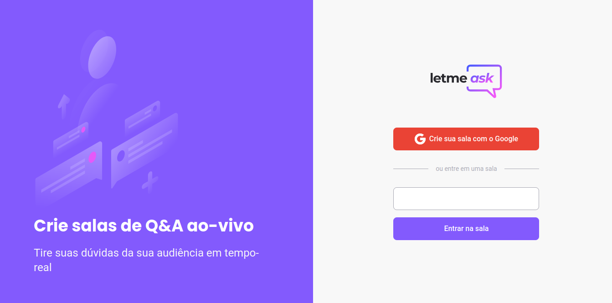
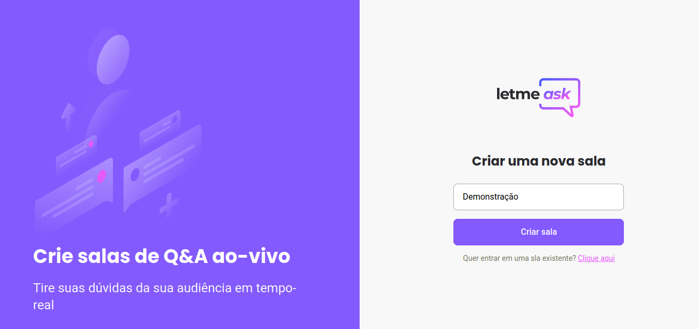
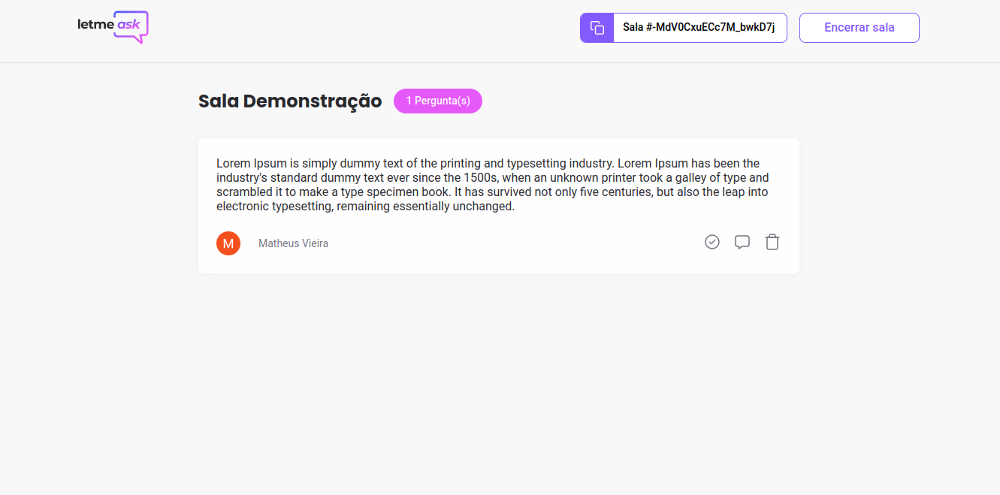
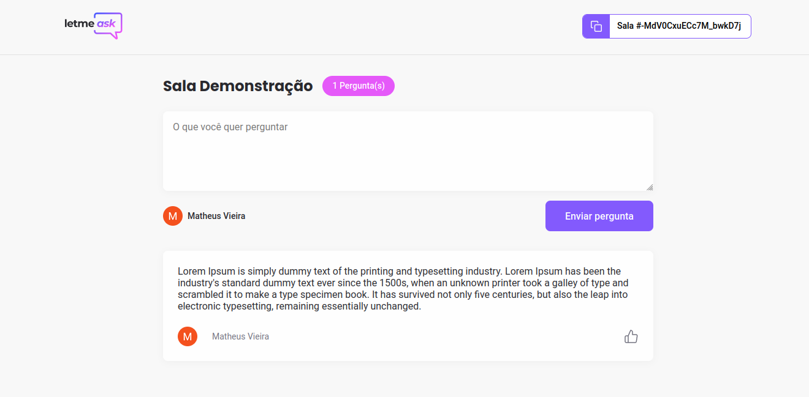

<h1 align="center">Letmeask</h1>

  

  Crie salas interativas com sua conta Google para facilitar a comunicação entre você e sua equipe ou seus usuários durante suas lives, recebendo as dúvidas em tempo real para que possa ser resolvidas em tempo hábil.

  

    <a aria-label="Matheus" href="https://github.com/matheusmaximianomv">
      </img>
    </a>
    <a aria-label="React" href="https://pt-br.reactjs.org/">
      </img>
    </a>
    <a aria-label="Typescript" href="https://www.typescriptlang.org/">
      </img>
    </a>
  

## Apresentação

Projeto desenvolvido na Next Level Week Together, ou NLW#6, semana de estudos, desenvolvida pela Rocketseat, baseados em trilhas. Na trilha de React foi possível o desenvolvimento da plataforma Letmeask utilizando React, Context API, Firebase e boas práticas.  

<h4 align="center">Página Inicial</h4>

<h4 align="center">Nova Sala</h4>

<h4 align="center">Sala</h4>

<h4 align="center">Sala Administrador</h4>

## Tecnologias

- React&nbsp;&nbsp;&nbsp;&nbsp;
- create-react-app&nbsp;&nbsp;&nbsp;
- Typescript&nbsp;&nbsp;&nbsp;
- Firebase&nbsp;&nbsp;&nbsp;
- SCSS&nbsp;&nbsp;&nbsp;

## Executando o Projeto

Para executar o projeto você precisa ter instalado o NPM ou o Yarn em sua máquina, em seguida, abra o terminal e execute os seguintes comandos:

1. Clone o projeto: `git clone https://github.com/matheusmaximianomv/letmeask`
2. Entre na pasta: `cd letmeask`
3. Instale as dependências:
 Usando NPM `npm install`
 Usando o Yarn `yarn`, caso tenha instalado.
4. Tenha um projeto web criado no firebase utilizando o realtime database.
5. Na pasta raíz crie um arquivo chamado .env.local com as mesmas configurações do arquivo .env, só que inserindo as informações que o firebase lhe forneceu.
6. Execute o projeto:
 Usando NPM `npm run start`
 Usando o Yarn `yarn start`, caso tenha instalado.
7. O App estará executando em http://localhost:3000

## Contribua

1. Fork it (https://github.com/matheusmaximiano/letmeask/fork)
2. Crie uma branch de feature (git checkout -b feature/algumacoisa)
3. Commit suas alterações (git commit -m 'Tipo: Modificação')
4. Dê o push para a nova branch (git push origin feature/algumacoisa)
5. Crie uma nova Pull Request
